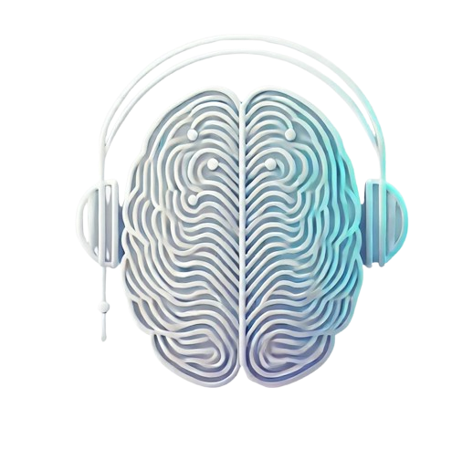
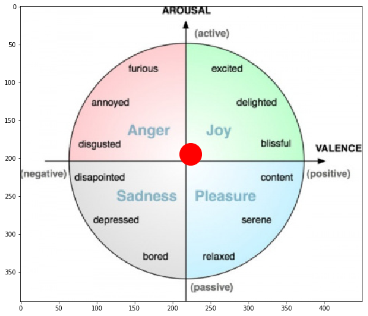

<p align="center">
  
</p>

<h1 align="center">MindBeats</h1>

<p align="center">
  <strong>Neuroadaptive Music Recommendation Powered by Brain-Computer Interfaces</strong>
</p>

<p align="center">
  <a href="https://devpost.com/software/mind-beats"></a>
  <a href="https://youtu.be/JeUc7xXdhSU"></a>
  <a href="https://www.linkedin.com/posts/pranay-joshi-_hackathon-ai-bci-activity-7294828653262102530-8nG-"></a>
</p>

<p align="center">
  
  
  
  
  
</p>

<p align="center"><b>Winner - Best Use of Streamlit @ UGAHacks X</b></p>

---

## The Problem

Traditional music recommendation systems rely on listening history and genre preferences, creating a **feedback loop** that narrows your musical world instead of expanding it. They assume your past dictates your present -- but your mood right now might be nothing like it was yesterday.

**What if music didn't just match your taste, but matched your mind?**

## The Solution

**MindBeats** flips the paradigm. Using a Brain-Computer Interface (BCI) headset, we read your brain's electrical activity in real-time, decode your emotional state through deep learning, and generate a playlist that *truly* reflects how you feel -- not just what you've listened to before.

> Music doesn't determine your mood. Your mood should determine your music.

<p align="center">
  <a href="https://youtu.be/JeUc7xXdhSU">
    
  </a>
</p>

---

## Architecture

```
┌─────────────────┐     LSL Stream      ┌──────────────────────┐
│   Muse 2 EEG    │ ──────────────────▶  │   Signal Processing  │
│   (4 channels)  │    256 Hz raw EEG    │                      │
│  TP9 AF7 AF8 TP10                      │  ● Downsample → 128Hz│
└─────────────────┘                      │  ● Bandpass 4-45 Hz  │
                                         │  ● Zero-mean norm    │
                                         └──────────┬───────────┘
                                                    │
                                                    ▼
                                         ┌──────────────────────┐
                                         │   EmotionNet V2      │
                                         │   (Deep CNN)         │
                                         │                      │
                                         │  Conv2D(32) → Pool   │
                                         │  Conv2D(64) → Pool   │
                                         │  Conv2D(64) → Pool   │
                                         │  Conv2D(64) → Pool   │
                                         │  Conv2D(64)          │
                                         │  Dense(64) → Dense(3)│
                                         └──────────┬───────────┘
                                                    │
                                          Valence, Arousal, Dominance
                                                    │
                                                    ▼
                                         ┌──────────────────────┐
                                         │   Mood Classifier    │
                                         │                      │
                                         │  VAD → Emotion Label │
                                         │  (8 mood categories) │
                                         └──────────┬───────────┘
                                                    │
                                                    ▼
                                         ┌──────────────────────┐
                                         │   GPT-4o-mini        │
                                         │                      │
                                         │  Emotion → 10 songs  │
                                         │  (no repeats)        │
                                         └──────────┬───────────┘
                                                    │
                                                    ▼
                                         ┌──────────────────────┐
                                         │   Streamlit UI       │
                                         │                      │
                                         │  Live EEG plot       │
                                         │  Mood display        │
                                         │  Playlist render     │
                                         └──────────────────────┘
```

---

## Emotion Space

The model outputs three continuous dimensions -- **Valence**, **Arousal**, and **Dominance** -- which are mapped onto the psychological circumplex model of affect to determine mood:

<p align="center">
  
</p>

<p align="center"><em>The Valence-Arousal circumplex model used for emotion classification</em></p>

| Valence | Arousal | Dominance | Mood |
|:-------:|:-------:|:---------:|:-----|
| High | High | High | Mildly Positive & Confident |
| High | High | Low | Slightly Positive but Hesitant |
| High | Low | High | Calm & Neutral |
| High | Low | Low | Relaxed but Withdrawn |
| Low | High | High | Frustrated but Assertive |
| Low | High | Low | Stressed & Overwhelmed |
| Low | Low | High | Indifferent & Passive |
| Low | Low | Low | Sad & Low Energy |

---

## How It Works

1. **Connect** -- Strap on the Muse 2 headset and start streaming EEG data via BlueMuse (LSL protocol).
2. **Record** -- MindBeats captures ~10 seconds of 4-channel EEG data (TP9, AF7, AF8, TP10) across 5 iterations.
3. **Process** -- Raw signals are downsampled from 256 Hz to 128 Hz, bandpass filtered (4-45 Hz), and zero-mean normalized.
4. **Predict** -- Processed EEG chunks are fed into **EmotionNet V2**, a 5-layer Convolutional Neural Network that outputs Valence, Arousal, and Dominance scores (scaled 1-9).
5. **Classify** -- The VAD scores map to one of 8 mood categories using the circumplex model.
6. **Recommend** -- The detected mood is sent to **GPT-4o-mini**, which generates 10 personalized song recommendations with no repeats across sessions.
7. **Listen** -- The playlist is rendered in a sleek Streamlit interface with Spotify and YouTube links.

---

## Tech Stack

| Layer | Technology | Purpose |
|:------|:-----------|:--------|
| **Hardware** | Muse 2 EEG Headset | 4-channel EEG signal acquisition |
| **Streaming** | BlueMuse + pylsl | Lab Streaming Layer protocol for real-time data |
| **Signal Processing** | SciPy, MNE-Python | Resampling, bandpass filtering, normalization |
| **Deep Learning** | TensorFlow / Keras | EmotionNet V2 CNN for emotion prediction |
| **Recommendation** | OpenAI GPT-4o-mini | Context-aware song recommendation |
| **Frontend** | Streamlit | Real-time dashboard with live EEG plots |
| **Visualization** | Matplotlib | EEG waveform rendering |

---

## Project Structure

```
MindBeats/
├── app/
│   ├── main.py            # Entry point -- Streamlit app with EEG pipeline
│   ├── emotionutils.py    # EEG processing, model loading, mood classification
│   ├── gpt.py             # OpenAI integration for song recommendations
│   ├── home.py            # Landing page component
│   ├── player.py          # YouTube playback utility
│   └── test_html.py       # HTML rendering test
├── models/
│   └── EmotionNetV2.h5    # Pre-trained CNN weights
├── assets/
│   ├── EmotionSpace.png   # Valence-Arousal circumplex diagram
│   ├── log.png            # MindBeats logo
│   └── ex.html            # HTML template
├── requirements.txt
├── .gitignore
└── README.md
```

---

## Getting Started

### Prerequisites

- Python 3.10+
- [Muse 2 EEG Headset](https://choosemuse.com/)
- [BlueMuse](https://github.com/kowalej/BlueMuse) (Windows) for LSL streaming
- An [OpenAI API key](https://platform.openai.com/api-keys)

### Installation

```bash
git clone https://github.com/pranayjoshi/mind_music.git
cd mind_music
pip install -r requirements.txt
```

### Configuration

Create a `.env` file in the project root:

```
KEY=your_openai_api_key_here
```

### Run

1. **Pair** your Muse 2 headset via Bluetooth.
2. **Start** BlueMuse and begin streaming.
3. **Launch** the app:

```bash
streamlit run app/main.py
```

---

## Team

| | Name |
|:--|:-----|
| 1 | **Pranay Joshi** |
| 2 | **Gaurav Shrivastava** |
| 3 | **Kavya Gupta** |
| 4 | **Priyanshu Sethi** |

---

## Links

- [Devpost Submission](https://devpost.com/software/mind-beats)
- [YouTube Demo](https://youtu.be/JeUc7xXdhSU)
- [LinkedIn Announcement](https://www.linkedin.com/posts/pranay-joshi-_hackathon-ai-bci-activity-7294828653262102530-8nG-)

---

<p align="center">
  Built with brainwaves at <strong>UGAHacks X</strong>
</p>
